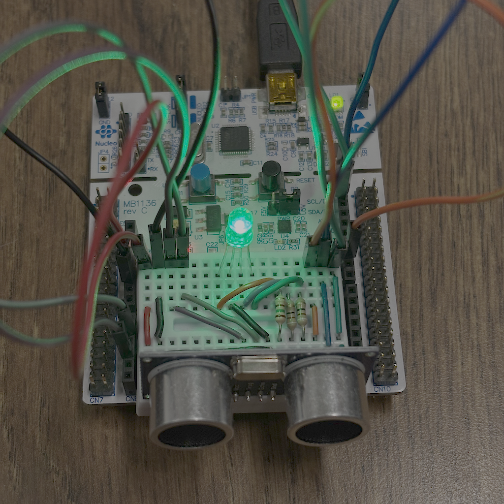
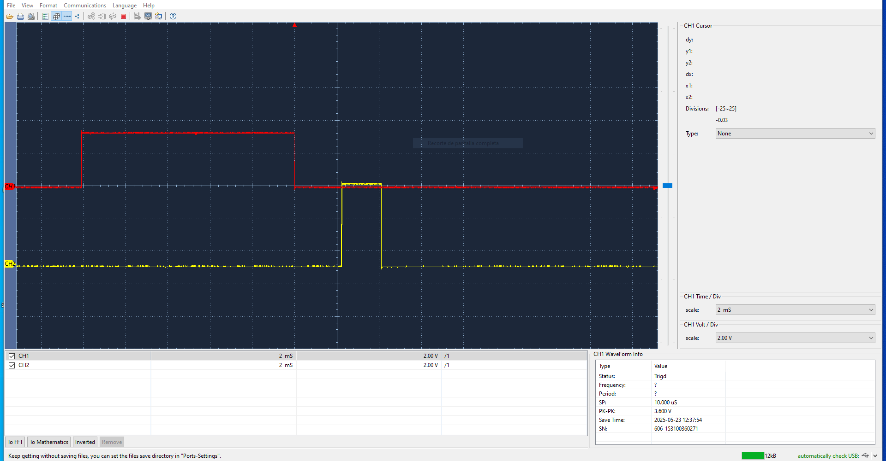

# Urbanite Project

## Author

* **Alex Martin-Romo Gonzalez** - email: [alex.martin-romo@alumnos.upm.es](mailto:alex.martin-romo@alumnos.upm.es)

Urbanite is a project focused on developing a parking sensor using the STM32 board and an ultrasonic sensor.
The system detects the distance to nearby objects, providing parking assistance through visual cues that alert the driver of potential obstacles.

Urbanite es un proyecto que busca desarrollar un sensor de aparcamiento utilizando una placa STM32 y un sensor de ultrasonidos. El sistema detecta la distancia a objetos cercanos, ofreciendo asistencia mediante señales visuales para alertar al conductor sobre posibles obstáculos.

## Version 1

In Version 1, the system works with the user button only. The user button is connected to the pin PC13. The code uses the EXTI13 interrupt to detect the button press.

·Introduced user button functionality using EXTI13 interrupt (connected to pin PC13).

·Basic FSM triggered by button press.

Link to the [FSM of Version 1](./docs/html/fsm__button_8c.html)
## Version 2

In Version 2, the system adds the ultrasonic transceiver (the HC-SR04) to measure the distance to an object. The trigger pin is connected to the pin PB0, and the echo pin is connected to the pin PA1. The code uses the TIM2, TIM3 and TIM5 timers to control the ultrasonic transceiver.

The distance is calculated by measuring the time difference between the trigger signal (sent) and the echo signal (received). This time interval represents the duration it takes for the ultrasonic pulse to travel to the object and return. Using the speed of sound, the distance is then computed with the formula:

Distance (cm) = Time (μs) / 58.3
Where 58.3 is the time in microseconds it takes sound to travel 1 cm (at 20°C in dry air).

Link to the [FSM of Version 2](./docs/html/fsm__ultrasound_8c.html)

## Version 3
In this version, an RGB LED display is developed and added, where each color is controlled by a PWM signal. This display allows us to indicate the distance of an obstacle from the car.
When a collision is imminent, the display turns red, while at greater distances it uses a palette of lighter colors such as yellow, green, and blue.

-Integrated RGB LED display controlled by PWM signals.
-Visual feedback for obstacle distance

Link to the [FSM of Version 3](./docs/html/fsm__display_8c.html)

## Version 4

Low-power modes are added to extend autonomy in portable systems. Sleep modes are implemented when the system is idle or paused, reducing energy consumption.
Additionally, the Urbanite library is integrated, combining the button input, ultrasonic sensor, and RGB display into a unified module to simplify system control and improve modularity.

·Implemented low-power modes to extend battery life in portable setups.

·Device enters sleep mode when idle or paused.

·Developed and integrated the Urbanite library, which unifies:

·Button control

·Ultrasonic sensing

·RGB visual feedback

Link to the [FSM of Version 4](./docs/html/fsm__urbanite_8c.html)

**Alex Martin-Romo, 2025**